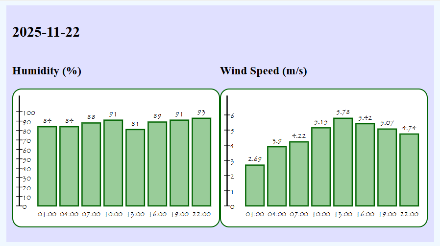

# DiagramWeatherApp

This is an app that fetches a 5-day weather forecast from OpenWeatherMap API and displays humidity and wind speed as bargraphs for the upcoming days. The app allows the user to easily view weather forecasts for a city, based on its local time.


## Purpose

The purpose of the app is to let users easily overview humidity and wind speed for their chosen city for the next 5 days. The diagrams will provide an easy way to read the weather data and give a visual aid in reading the prognosis.




## Functional requirements

- The user should be able to see humidity and wind speed for a city of their choice.
- The user should be able to see humidity and wind speed for each day, displayed as diagrams.
- The user should be able to see the weather data based on the local time for the chosen city.
- The user should be given an error message if the city is not available.


## Installation guide

Clone the repository:
``` 
git clone https://github.com/ed223bd/L3
```

Create a .env file:
```
API_key=your-api-key
PORT=your-port
```

Install dependencies:
```
npm install
```

Run the application:
```
npm start
```


## Dependencies

- The DiagramCreator module
- LNU extension of eslint
- dotenv
- node-fetch


## Technologies

- Node.js
- Javascript
- HTML/CSS
- Express
- OpenWeatherMap API


## Licence

MIT Licence
