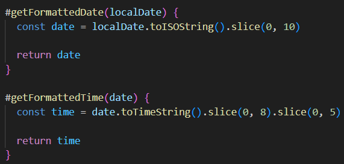
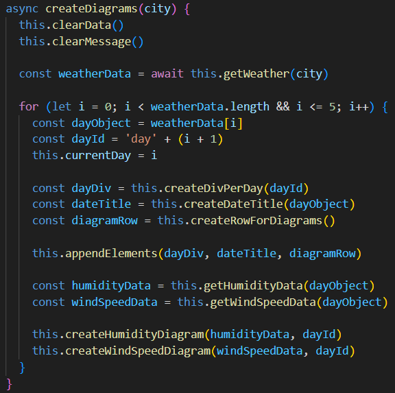
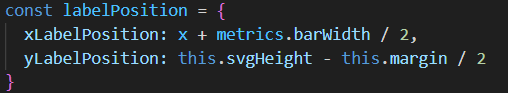
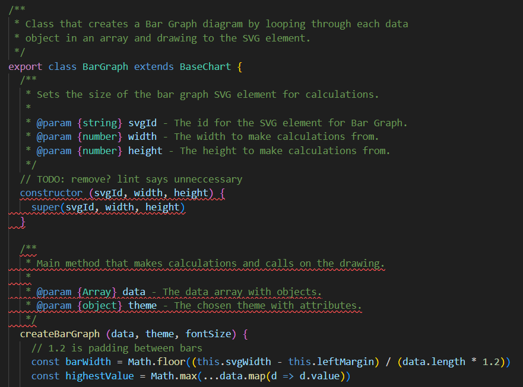
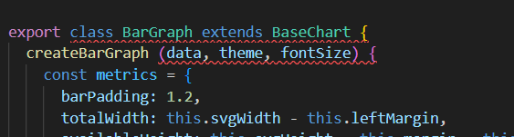
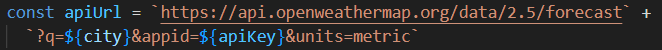
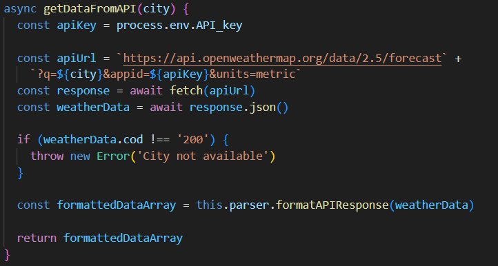
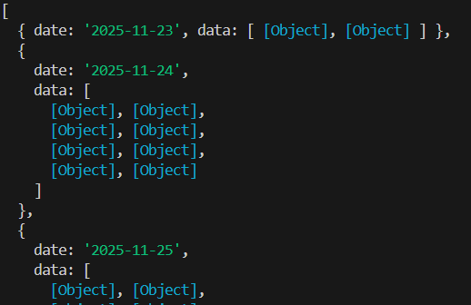
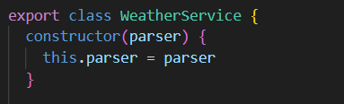
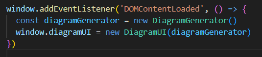

# Reflektioner av boken Clean Code

## Kapitel 2 - Meningsfulla namn
Namngivning är något jag tänkt mycket på i skapandet av detta projekt och till skillnad från L2 har jag i detta projekt tänkt på namngivning genomgående, istället för att säkerställa bra namn i slutet av projektet. 

Med funktionsnamn som getDataFromAPI och formatAPIResponse framgår det tydligt vad funktionernas syfte är. Även variabelnamn, tex. formattedDataArray, speglar tydligt vad det är variabeln innehåller.

## Kapitel 3 - Funktioner
En annan viktig lärdom är hur man bör dela upp funktioner. Jag har brutit ut många kodbitar till mindre funktioner (med ett tydligare ansvar), t.ex.: 

men det finns också större funktioner som nog gör mer än de borde göra, t.ex.:

i klassen DiagramGenerator. Den både skapar element och lägger till dem till DOM. Ett sätt att lösa detta hade varit att låta klassen DiagramUI lägga till elementen, men tyvärr tog tiden slut för att hinna ändra detta.
Jag har ansträngt mig för att hitta sätt att använda färre parametrar till funktioner, både i L2 och i L3. I L2 har det varit svårt för att varje funktion som ritar ut element behöver x- och y-positioner. Jag har ändrat i koden för L2, till att skapa ett object metrics som innehåller återkommande parametrar och har även skapat ett objekt för positioner i klassen BarGraph, igen för att minska antalet parametrar.

Det är också ett bra sätt att gruppera data och passar bra i uppgift L2 där det användes mycket koordinater för att placera ut objekt.

## Chapter 4 - Kommentarer
Clean Code säger att kommentarer är i de allra flesta fall är onödiga, och att användning av onödiga kommentarer gör att de viktiga kommentarerna lätt faller mellan fingrarna. I mitt projekt har jag inte använt några kommentarar, då jag anser att det finns en bra namngivning och därmed inget behov av kommentarer. I L2 hade jag tidigare en del kommentarer, men jag har strukturerat om koden genom att skapa variabler, namnge funktioner på ett sätt som avslöjar funktionens syfe och att ta bort onödiga kommentarer och dokumentation.

Tidigare version av BarGraph i L2:

Efter att ha strukturerat om:

## Chapter 5 - Formatering

I projektet har jag ansträngt mig för att hålla raderna korta, för att hålla mig till regeln om horisontell formattering. Samtidigt har jag lagt till extra mellanrum runt operatorer, för att öka läsbarheten.

Jag har också försökt använda vertikal formattering, genom att skilja de olika delarna av koden med blankrader. Nedan är ett exempel på att läsning av API-nyckeln, kod för API-funktionalitet, felhantering, anrop av formatAPIResponse metoden och returvärdet har separerats för ökad läsbarhet.

Ordningen på metoder i klasser har jag strukturerat så att de publika metoderna är högst upp, följt av privata metoder och till sist små hjälpfunktioner. Jag har även följt regler om att, där det är logiskt, ordna funktioner i den tur de kallas.

Clean Code säger också att klasser ska vara relativt små, för att hålla filen läsbar. Mina klasser är generellt korta, men DiagramGenerator är enligt Clean Code på gränsen till för stor. Om jag hade haft mer tid, hade jag skapat en till klass som haft ansvar för att skapa element dynamiskt.

## Chapter 6 - Objekt och datastrukturer

Det här är det kapitel jag haft svårast att förstå. Det är för mig obekanta begrepp och inget jag känner igen från tidigare kurser. Jag har lärt mig att objekt döljer sin data och exponerar beteenden, medan datastrukturer gör tvärtom och exponerar sin data men saknar beteenden. En viktig del i detta kapitel är att inte blanda olika typer av data. 

Jag har jobbat mycket med datastrukturer i applikationen, då jag behövt strukturera data i backend för att skicka till frontend. Modulen förväntar sig en array med objekt, men jag ville även skicka med ett datum för att kunna jobba med layouten i frontend. Nedan är en logg av datan som skickas till frontend:

## Kapitel 7 - Felhantering

I enlighet med Clean Code, har jag valt att kasta undantag som min felhantering. Clean Code säger att undantagen ska vara beskrivande och att fel ska hanteras tidigt. Att kasta undantag är något jag lärt mig sedan tidigare, men vikten av att kasta undantag tidigt är något jag har fått nya insikter om under denna kurs.

## Kapitel 8 - Gränssnitt mot externa system
Kapitlet nämner att det är viktigt att skilja den egna koden från exempelvis externa bibliotek, API:er och moduler. I min kod är det endast WeatherService som pratar med API:et, vilket innebär att om API:ets endpoints ändras är det endast WeatherService som behöver ändras. 

Min frontend använder inte direkt den data som API:et ger, för att datan struktureras om via min WeatherParser metod i backend. Den agerar som en mellanhand mellan det anropet och hur datan används i frontend. 

Kapitlet rekommenderar också "dependency injection", istället för att skapa nya instanser direkt. Att skicka in beroenden via konstruktorn gör att klasserna har en lösare koppling och hör klassen lättare att testa. "Dependency injection" är något jag använt mig av i L3, exempelvis där jag skickar in WeatherParser till WeatherService.

## Kapitel 9 - Enhetstester
I detta projekt har jag inga traditionella enhetstester. Jag har valt att testa manuellt och att då testa de funktioner användaren ska ha tillgång till, enligt de krav som är listade för applikationen. Det finns delar i projektet som hade varit lättare att applicera enhetstester på, exempelvis metoderna formatAPIResponse eller #convertToLocalTimezone i klassen WeatherParser. Dessa metoder returnerar något vilket för det lättare att skriva enhetstester, till skillnad från andra metoder som uppdaterar DOM eller gör själva API-anropet. Funktioner som har den typen av funktionalitet testas bättre med end-to-end testning.

## Kapitel 10 - Klasser
I boken framkommer det att klasser ska vara små och fokuserade på ett enda syfte. Ett bra sätt att strukturera klasser på, är att tydligt dela upp efter funktionalitet. Med det menas att dela upp efter UI, formattering, anrop till externa services och liknande. Det är något jag tänkt på i skapandet av min backend. Jag skapade först en enda klass WeatherService som både gjorde API-anropet och formatterade datan. Senare bröt jag ut en stor del av funktionaliteten i WeatherService till WeatherParser, för att WeatherService ska hålla sig till sitt ansvarsområde (API-anropet) och inte göra för mycket. Klasserna i L3 och L2 har privata metoder så långt det är möjligt.

## Kapitel 11 - System 
Kapitlet handlar om hur man bör bygga upp ett system, inte bara i form av klasser. Det handlar om att dela upp olika lager, så som UI, API, formattering m.m. Här nämns också att klasser och objekt bör instansieras i en "composition root" vilket är en startpunkt för applikationen. Jag har använt index.js som "composition root" i frontend:

Jag borde ha gjort likadant för backend, med att skapa instanser i filen som startar projektet (server.js).

Appliaktionen är anpassningsbar för ändringar, genom att den skapar element dynamiskt, har en egen klass för API anropet och att den är tydligt uppdelad i olika syften.

Jag anser att om man följt regler för hur klasser ska skapas, är det lätt att följa Clean Code för system. Många av de regler som presenteras i kapitlet om system, gäller även för skapande av klasser och hur funktionalitet bör delas upp. Det som skiljer detta kapitel åt, är att det berör även skapande av instanser och filer som inte är klasser i ett projekt. 
